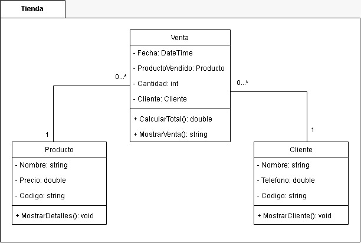

  <h1>Simulacro Parcial</h1>

## 1. Biblioteca "Lectura Viva"

> Una biblioteca local llamada **"Lectura Viva"** desea implementar un sistema que les permita gestionar los préstamos de libros a sus miembros. La biblioteca tiene varios libros disponibles, y cada miembro puede tomar prestado un libro a la vez.

### Entidades principales del sistema:

1. **Miembro**: Es una persona registrada en la biblioteca, que tiene un nombre, un número de identificación único y una fecha de registro.
2. **Libro**: Cada libro tiene un título, un autor y un código ISBN que lo identifica de manera única.
3. **Préstamo**: El préstamo representa la acción de un miembro que toma un libro prestado. El préstamo incluye la fecha en que se prestó el libro y la fecha en que debe ser devuelto.

### Restricciones:

- Un miembro solo puede tener un libro en préstamo a la vez.
- Un libro puede estar disponible o prestado, pero solo puede estar en préstamo a un miembro a la vez.
- Cada préstamo está vinculado a un único miembro y un único libro.

---

## 2. Tienda de Electrónicos

> Una tienda de electrónicos quiere digitalizar su inventario y sus ventas. El sistema que planean implementar ya tiene un diseño de clases, pero ahora necesitan que se programe. La tienda gestiona sus productos y cada venta realizada. El sistema debe permitir llevar el registro de los productos disponibles y las ventas efectuadas.

  

---

## 3. Empresa de Taxis Urbanos

> Una empresa de taxis urbanos desea implementar un nuevo sistema para gestionar sus servicios de transporte. El sistema deberá permitir que los conductores y pasajeros gestionen sus viajes de forma más eficiente y organizada, eliminando la necesidad de reservas telefónicas.

### Entidades del sistema:

- **Conductores**: Cada conductor tiene un perfil en el sistema, el cual incluye su nombre completo, número de licencia y su estado de disponibilidad. Solo los conductores que están disponibles pueden aceptar nuevos viajes, por lo que su estado debe poder cambiarse cuando estén ocupados o libres.
- **Pasajeros**: Los pasajeros deben estar registrados con su nombre, dirección y un estatus de membresía que indica si son miembros o no del programa de fidelidad de la empresa. Los miembros tienen la ventaja de recibir un descuento del 10% en cada uno de sus viajes. Los pasajeros pueden solicitar un viaje indicando la distancia en kilómetros y el tipo de vehículo que necesitan.

### Tipos de vehículos:

- **Auto estándar**
- **Van**: diseñada para grupos más grandes.

### Proceso de solicitud y cálculo de tarifas:

1. Cuando un pasajero solicita un viaje, se le asigna automáticamente un conductor disponible.
2. El sistema debe calcular el costo del viaje basado en:

   - **Tarifa base**: $10.00.
   - **Costo adicional**: $2.00 por kilómetro recorrido.
   - Si el pasajero es miembro, se aplicará un **descuento del 10%** sobre el costo total.

3. Una vez que el viaje ha sido completado, el conductor debe marcarlo como tal en el sistema. Solo entonces el sistema permitirá al conductor volver a estar disponible para nuevos viajes.

### Ejemplo:

Laura Sánchez es pasajera habitual de la empresa y forma parte del programa de fidelidad. Vive en la Calle 123 y necesita hacer un viaje de 15 km en un auto estándar. Carlos Gómez, un conductor con la licencia XYZ1234, está disponible y es asignado para el viaje. El sistema debe calcular el costo del viaje para Laura, aplicando el descuento correspondiente por ser miembro.

### Detalles adicionales:

- **Tarifa base**: $10.00.
- **Costo adicional**: $2.00 por kilómetro.
- **Descuento para miembros**: 10% sobre el costo total.
- **Estado de disponibilidad de los conductores**: Cambia al finalizar el viaje.
